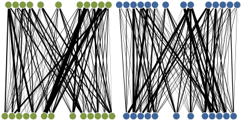
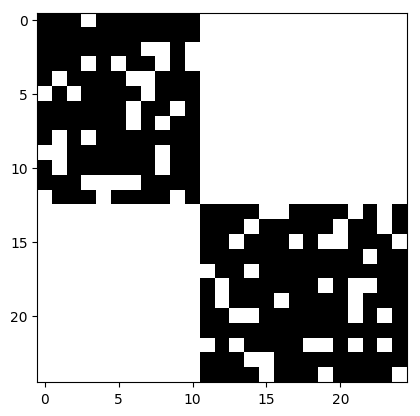
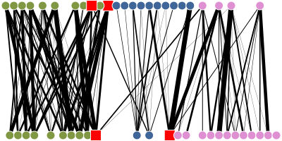
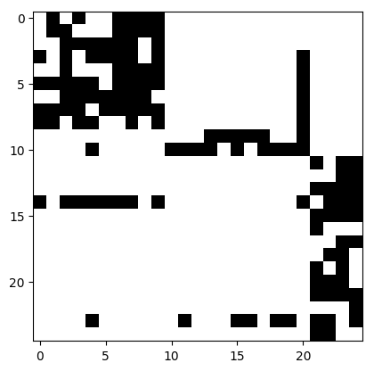

**Importante note: The source code will be available from 26th June, 2017**

## BNOC: A benchmarking tool to generate bipartite network models with overlapping communities

**About**

BNOC is a tool for benchmarking weighted bipartite network with overlapping community structures. BNOC can create network  with balanced or unbalanced overlapping communities, heterogeneous community sizes, different intra- and inter-community edge densities, and with varying average degrees and clustering coefficients. The set of parameters, described in  the table below, controls the bipartite network features.

**Usage**

```
python bnoc.py [options]
```

| Option				| Domain					    | Description											     |
|:--------------------- |:----------------------------  |:---------------------------------------------------------- |
| -v, --vertices        | [1, V] Integer interval       | Number of vertices for each layer (array of two values)    |
| -c, --communities     | [1, V] Integer interval       | Number of communities                                      |
| -p, --probability     | (0, V] Real interval          | Probability of vertices in each community                  |
| -b, --balanced        | {0, 1}                        | Boolean balancing flag that suppresses -p parameter        |
| -x, --overlap         | [0, V_1] Integer interval     | Number of overlapping vertices in V_1                      |
| -y, --overlap         | [0, V_2] Integer interval     | Number of overlapping vertices in V_2                      |
| -z, --noverlap        | [0, c] Integer interval       | Number of overlapping communities                          |
| -d, --dispersion      | (0, 1] Real interval          | Dispersion of negative binomial distribution               |
| -m, --mu              | Real                          | Range of weights values                                    |
| -n, --noise           | (0, 1] Real interval          | Noise                                                      |

**Examples**

    $ python bnoc.py -dir output -o network1 -v 25 25 -c 2 -d 0.8 -b
    $ python plot-bipartite-graph.py -f output/network1.ncol -o network1 -v 25 25 -m -b 400 200 -s -e png



    $ python plot-bipartite-matrix.py -f output/network1.ncol -o matrix1 -v 25 25 -b 200 100 -s -e png



    $ python bnoc.py -dir output -o network2 -v 25 25 -c 3 -d 0.4 -b -x 2 -y 2 -z 2
    $ python plot-bipartite-graph.py -f output/network2.ncol -v 25 25 -m -b 400 200 -s -e png



    $ python plot-bipartite-matrix.py -f output/network2.ncol -o matrix2 -v 25 25 -b 200 100 -s -e png



**References**

> [1] Valejo, A.; Goes, F.; Oliveira, M. C. F.; Alneu, A. A.: An open-source benchmarking tool for overlapping community detection in bipartite network. (2017)

~~~~~{.bib}
@article{Alan2016,
    author={Alan Valejo and Fabiana Goes and Maria Cristina Ferreira de Oliveira and Alneu de Andrade Lopes},
    title={An open-source benchmarking tool for overlapping community detection in bipartite network.},
    year={2017}
}
~~~~~
